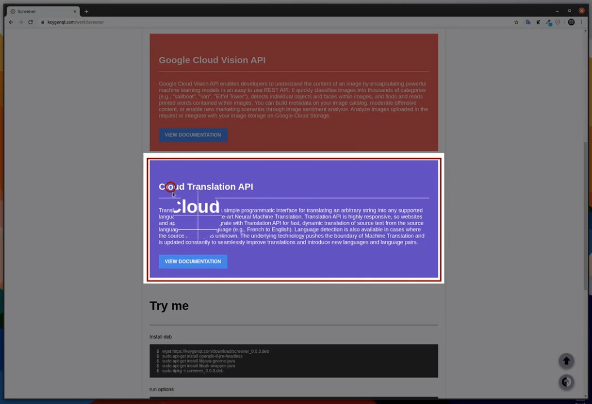

ScreeenerQt
===================

ScreeenerQt open source gui for console application Screeener.

## Release

### Info

Linux app for easy screenshot

* Selection area
* Selection area delay
* Desktop
* Search screenshot in Google
* Cloud Vision (select text from screenshot)
* Cloud Translate (translate select text from screenshot)
* Save image in buffer
* Save image in imgur

### Preview

